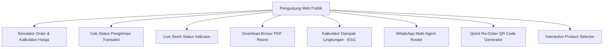

# Rencana & Instruksi Pengembangan Website SIDARMA (SIMADAR)
*Dokumen Rencana Fitur, Analisis Kesenjangan (Gap Analysis), Adopsi Fitur Ismajun, dan Inovasi Digital.*

---

## 1. Ringkasan Sistem Saat Ini (Current State)
Saat ini, **SIDARMA** (atau **SIMADAR**) adalah sistem informasi manajemen internal untuk bisnis kain majun (kain perca industri) yang dikombinasikan dengan halaman landing page publik.

### Fitur yang Sudah Ada di Codebase:
1. **Landing Page Publik (`src/app/page.tsx` & `LandingClient.tsx`)**:
   - Tampilan hero section dengan info WhatsApp.
   - Statistik dasar (Tahun Pengalaman, Toko Customer, Stok Tersedia, dll).
   - Katalog produk sederhana (hanya 2 jenis: Majun Putih & Majun Warna).
   - Penjelasan singkat tentang keunggulan perusahaan.
   - Peta lokasi (Google Maps Embed) & Informasi alamat/kontak statis.
   - Tombol *Call to Action* (CTA) ke WhatsApp.
   - Halaman login admin.
2. **Dashboard Admin Internal (`src/app/dashboard/*`)**:
   - Manajemen Keuangan: Total pemasukan, pengeluaran, profit, dan grafik bulanan.
   - Manajemen Transaksi: Transaksi pembelian (Purchases) dari supplier dan penjualan (Sales) ke customer.
   - Manajemen Pembayaran: Catatan cicilan pembayaran dari customer (`SalePayment`).
   - Manajemen Stok: Pencatatan otomatis stok masuk & keluar untuk majun putih & warna (`InventoryMovement`).
   - Manajemen Kontak: Data pelanggan (Customer) dan pemasok (Supplier).
   - Pengaturan Landing Page: Pengeditan konten landing page secara dinamis dari dashboard admin (`LandingSetting`).

---

## 2. Analisis Kekurangan Website Saat Ini (Gap Analysis)
Dibandingkan dengan situs web pemasaran profesional di industri yang sama, website SIDARMA saat ini memiliki beberapa kekurangan:

> [!WARNING]
> **Kekurangan Utama Teridentifikasi:**
> 1. **Katalog Produk Terlalu Sederhana**: Hanya menampilkan deskripsi singkat tanpa variasi detail produk.
> 2. **Tidak Ada Fitur Edukasi (Artikel/Blog)**: Mengurangi kekuatan SEO (Search Engine Optimization) di Google, sehingga sulit mendatangkan traffic organik.
> 3. **Tidak Ada Halaman Karir (Career)**: Padahal industri konveksi/majun seringkali membutuhkan rekrutmen pekerja jahit, sortir, atau staf gudang secara berkelanjutan.
> 4. **Testimonial Belum Dinamis**: Belum ada bagian khusus testimoni dari pelanggan besar (pabrik, bengkel, distributor retail) yang meyakinkan calon pembeli baru.
> 5. **Informasi Kontak Kurang Interaktif**: Belum terhubung dengan banyak opsi media sosial dan tidak ada formulir kontak langsung di web.

---

## 3. Fitur yang Diadopsi dari Website Ismajun (`ismajun.com`)
Website kompetitor utama, **Ismajun Indonesia**, memiliki struktur pemasaran digital yang sangat rapi. Berikut adalah fitur-fitur penting dari Ismajun yang akan diadopsi ke dalam SIDARMA:

### A. Katalog Produk Terkategori Secara Detail
Ismajun membagi produk mereka menjadi beberapa kategori spesifik. Kita akan mengadopsinya ke dalam menu produk SIDARMA:
- **Kain Majun Lembaran (Tanpa Jahit)**: Kain potongan utuh, biasanya digunakan untuk lap mesin presisi karena tidak ada sambungan jahitan.
- **Kain Majun Jahit Sambung**: Potongan kain perca yang dijahit menyambung memanjang. Ekonomis dan berdaya serap tinggi.
- **Kain Majun Jahit Tumpuk**: Beberapa lapis kain perca dijahit bertumpuk (tebal), sangat cocok untuk membersihkan oli/kotoran berat.
- **Sarung Tangan Proyek / Industri**: Pelengkap kebutuhan safety pabrik (sarung tangan benang/katun).
- **Alat Pelindung Diri (APD) / Safety Equipment**: Masker, kacamata proyek, dll., sebagai produk pelengkap (*cross-selling*).

### B. Bagian Testimonial Pelanggan (Social Proof)
- Menampilkan ulasan positif dari pembeli berskala industri (bengkel otomotif, pabrik manufaktur, kapal, dll) lengkap dengan nama perusahaan dan logo (jika diizinkan).
- Dibuat dinamis sehingga admin bisa menambah/mengedit testimonial dari dashboard admin.

### C. Halaman / Section Artikel & Blog (SEO Booster)
- Halaman khusus untuk artikel/berita seputar industri kain majun, limbah garmen, serta tips kebersihan alat-alat industri.
- *Contoh topik artikel:* "Mengapa Kain Majun Katun Paling Baik untuk Lap Oli?", "Perbedaan Majun Jahit vs Lembaran".
- Meningkatkan peringkat pencarian website di Google secara organik.

### D. Halaman Lowongan Kerja & Karir (Career Page)
- Halaman informasi lowongan pekerjaan untuk posisi penjahit kain majun, staf sortir, sopir pengiriman, atau sales marketing.
- Formulir pendaftaran online sederhana bagi pelamar untuk mengirimkan CV/data diri.

### E. Integrasi Media Sosial Lengkap (Social Media Trust)
- Link tautan sosial media resmi seperti Instagram, Facebook, LinkedIn, TikTok, dan YouTube di bagian footer untuk meningkatkan kredibilitas perusahaan.

---

## 4. Perbedaan Layout & Estetika Visual (BEDA LAYOUT!)
Meskipun kita mengadopsi fitur-fitur dari Ismajun, **layout dan desain visual SIDARMA tidak akan meniru Ismajun**. 

> [!IMPORTANT]
> **Pedoman Desain Layout SIDARMA:**
> - **Bukan Blog Tradisional**: Ismajun menggunakan template WordPress tradisional yang bertumpuk vertikal dan terkesan kuno. 
> - **SaaS / B2B Fintech Portal Style**: SIDARMA akan menggunakan estetika modern layaknya aplikasi finansial global (seperti Stripe atau Linear). Menggunakan font sans-serif premium (Inter/Outfit), layout grid yang rapi, card interaktif dengan *soft shadow*, serta navigasi samping/bawah yang intuitif.
> - **Interactive Component Switching**: Dibanding membuat halaman statis panjang, kita menggunakan komponen dinamis (seperti Tabs dari shadcn/ui) untuk menyaring produk, artikel, dan testimoni.
> - **Micro-Animations**: Transisi halus saat perpindahan halaman, efek hover interaktif pada tombol, dan animasi loading skeleton yang elegan.

---

## 5. Inovasi Unggulan & Fitur Unik untuk SIDARMA
Untuk membedakan SIDARMA dengan Ismajun dan website kompetitor lainnya, kita akan menambahkan inovasi digital berikut:

### 1. Simulator & Kalkulator Estimasi Harga Order
- **Cara Kerja**: Calon pelanggan dapat memilih jenis kain majun, memasukkan berat pesanan (dalam kg/bal), dan memilih metode pengiriman.
- **Manfaat**: Sistem secara otomatis menghitung estimasi total harga dan perkiraan berat barang.
- **Integrasi**: Di akhir kalkulasi, ada tombol **"Pesan Sekarang via WhatsApp"** yang otomatis memformat teks chat dengan detail kalkulasi tersebut.

### 2. Sistem Lacak Order Publik (Public Order Tracker)
- **Cara Kerja**: Karena SIDARMA sudah memiliki data penjualan (`Sale`) di admin panel, kita bisa membuat halaman publik di mana pelanggan cukup memasukkan **ID Transaksi** mereka.
- **Manfaat**: Pelanggan bisa melihat status pesanan mereka secara mandiri (*Pending*, *Diproses*, *Dikirim* dengan info resi ekspedisi, atau *Selesai*) tanpa harus selalu chat admin.

### 3. Indikator Stok Live Publik (Live Stock Status)
- **Cara Kerja**: Menampilkan label status stok secara real-time di landing page (diambil dari data stok riil di database admin).
- **Manfaat**: Menampilkan badge **"Ready Stock [X] Ton"** atau **"Stok Terbatas"** untuk memicu rasa urgensi (*FOMO*) calon pembeli agar segera memesan.

### 4. Download E-Brosur / Penawaran Resmi PDF Satu Klik
- **Cara Kerja**: Menyediakan tombol untuk mengunduh brosur digital dan daftar harga resmi dalam format PDF yang rapi.
- **Manfaat**: Memudahkan pembeli korporasi (purchasing staff dari perusahaan besar) yang membutuhkan dokumen fisik untuk diajukan ke manajemen mereka.

### 5. Kalkulator Dampak Lingkungan (ESG & Green Recycle Impact)
- **Cara Kerja**: Pengunjung memasukkan jumlah kain majun yang dipesan, dan sistem menghitung dampak positifnya terhadap lingkungan (misal: *"Membeli 500kg majun putih mendaur ulang 500kg limbah tekstil katun, menghemat 1.200 liter air, dan mengurangi emisi karbon sebanyak 250kg"*).
- **Manfaat**: Menyediakan **"Mock Green Certificate"** yang bisa diunduh oleh purchasing manager pabrik sebagai pelengkap laporan keberlanjutan (ESG / ISO 14001) perusahaan mereka. Ini nilai tambah sangat besar untuk klien korporat.

### 6. WhatsApp Multi-Agent Router (Rotasi Kontak Otomatis)
- **Cara Kerja**: Tombol WhatsApp di landing page secara otomatis memutar nomor admin tujuan (Sales Admin A, Sales Admin B, Billing) secara bergiliran (*round-robin*) atau acak.
- **Manfaat**: Membagi beban chat secara adil jika admin customer service lebih dari satu orang, mempercepat waktu respon pemesanan.

### 7. Quick Re-Order QR Code (Order Ulang Instan)
- **Cara Kerja**: Admin dapat menghasilkan QR Code unik di setiap faktur/invoice atau label box pengiriman. Ketika customer memindai QR tersebut via smartphone, mereka akan diarahkan ke halaman web berisi riwayat pemesanan mereka sebelumnya dengan tombol **"Order Ulang dengan 2 Klik"**.
- **Manfaat**: Memudahkan toko customer untuk memesan kembali tanpa perlu mengetik ulang pesanan mereka atau menghubungi sales secara manual.

### 8. Interactive Product Selector (Rekomendator Lap Majun)
- **Cara Kerja**: Modul interaktif di mana pengunjung memilih apa yang ingin dibersihkan (misal: "Oli Kental", "Debu Halus", "Cairan Kimia", atau "Mesin Kaca Sensitif"). Sistem akan memberikan rekomendasi jenis majun yang tepat (misal: Majun Lembaran untuk mesin presisi kaca, Majun Jahit Tumpuk untuk oli kental).
- **Manfaat**: Membantu calon pembeli yang awam agar tidak salah membeli produk.

---

## 6. Strategi Super SEO (Search Engine Optimization)
Agar website SIDARMA berada di peringkat teratas hasil pencarian Google, kita akan menerapkan optimasi SEO tingkat lanjut berikut:

### A. Dynamic Metadata & OpenGraph
Setiap halaman publik dan artikel blog akan memiliki metadata dinamis yang dioptimalkan untuk mesin pencarian dan media sosial:
- **Title Tag yang Menarik**: Menggunakan kata kunci berdaya saing tinggi (contoh: *"Jual Kain Majun Putih & Warna Murah - Distributor [Nama Kota]"*).
- **Meta Description Tertarget**: Menampilkan rangkuman isi halaman dengan kata kunci yang ramah mesin pencari untuk menarik klik.
- **OpenGraph & Twitter Card**: Menyediakan thumbnail gambar kustom agar saat tautan web dibagikan ke WhatsApp, Telegram, atau Facebook, muncul kartu tautan yang rapi dan profesional.

### B. Otomatisasi XML Sitemap & Robots.txt (`src/app/sitemap.ts` & `robots.ts`)
Next.js memiliki generator XML sitemap bawaan. Kita akan memanfaatkannya untuk membuat sitemap dinamis:
- Menghasilkan daftar URL semua halaman publik, artikel blog dari database, dan kategori produk secara otomatis.
- Membantu robot Google (Googlebot) mendeteksi dan mengindeks artikel/produk baru hanya beberapa menit setelah dipublikasikan oleh admin.

### C. Schema Markup / Structured Data (JSON-LD)
Kita akan menanamkan Structured Data berformat JSON-LD pada kode HTML untuk membantu Google memahami konteks website dan menampilkan "Rich Snippets" di hasil pencarian:
- **LocalBusiness Schema**: Memberitahu Google tentang alamat gudang, koordinat GPS, nomor WhatsApp, jam buka, dan nama legal perusahaan.
- **Product Schema**: Menampilkan rating bintang produk, harga distributor, dan status stok langsung pada ringkasan hasil pencarian Google.
- **Article Schema**: Membuat artikel blog kita bisa masuk ke bagian Google News atau korsel artikel terpopuler di Google.

### D. Performa & Core Web Vitals (Peringkat Lebih Tinggi karena Web Cepat)
Google memprioritaskan website yang dimuat dengan sangat cepat:
- **Next.js `<Image>` Component**: Optimasi gambar otomatis (konversi otomatis ke format modern `.webp` yang ringan) serta lazy loading untuk menghemat bandwidth.
- **Static Page Generation (SSG) & Incremental Static Regeneration (ISR)**: Artikel blog akan dirender di sisi server dan disimpan dalam cache (revalidate 1 jam). Googlebot akan langsung mendapatkan HTML lengkap tanpa harus menunggu Javascript di-render.
- **Semantic HTML**: Menggunakan struktur tag HTML5 yang bersih (`<header>`, `<main>`, `<article>`, `<section>`, `<h1>` tunggal per halaman) untuk memudahkan crawler membaca konten.

---

## 7. Rencana Perubahan Struktur File & Database

Untuk mengimplementasikan seluruh fitur di atas, berikut adalah estimasi modifikasi file yang akan kita lakukan pada project Next.js ini:

### A. Skema Database (`prisma/schema.prisma`)
Kita perlu menambahkan beberapa model baru:
- `Article`: Menyimpan data artikel/blog (judul, konten, slug, thumbnail, tanggal rilis).
- `Testimonial`: Menyimpan testimonial pelanggan (nama, perusahaan, isi ulasan, rating, logo/avatar).
- `Career`: Menyimpan data lowongan kerja aktif dan data pelamar masuk.

### B. Penambahan Halaman Baru (Next.js App Router)
- `[NEW] src/app/sitemap.ts` - Generator XML Sitemap dinamis.
- `[NEW] src/app/robots.ts` - File instruksi crawler mesin pencari.
- `[NEW] src/app/artikel/page.tsx` - Daftar artikel/blog publik.
- `[NEW] src/app/artikel/[slug]/page.tsx` - Halaman detail baca artikel.
- `[NEW] src/app/karir/page.tsx` - Halaman info karir dan formulir lamaran.
- `[NEW] src/app/lacak-pesanan/page.tsx` - Halaman pelacakan status transaksi.
- `[NEW] src/app/kalkulator/page.tsx` - Halaman simulator, kalkulator harga, dan ESG calculator.

### C. Pembaruan Halaman & Fitur Dashboard Admin
- `[MODIFY] src/app/dashboard/landing/page.tsx` - Ditambah form kelola Testimonial & Kelola Brosur PDF.
- `[NEW] src/app/dashboard/articles/page.tsx` - CRUD artikel blog (tulis, edit, hapus artikel).
- `[NEW] src/app/dashboard/careers/page.tsx` - Kelola lowongan kerja & pelamar masuk.

---

> [!NOTE]
> Dengan mengimplementasikan rencana ini, **SIDARMA** tidak hanya menjadi aplikasi kasir/admin internal biasa, melainkan bertransformasi menjadi **platform digital marketing & operational** terintegrasi yang jauh lebih unggul dibanding kompetitor sejenis.
